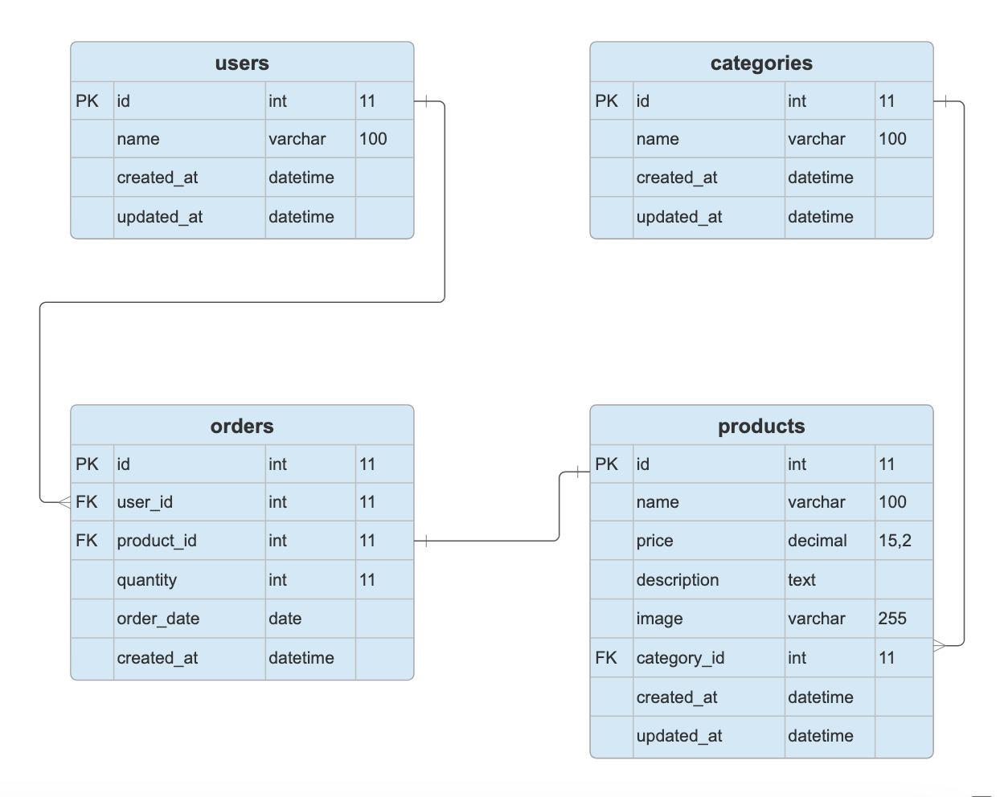

# Product Management assesment

## Entity-Relationship Model

Products `products`
`id`, `name`, `description`, `price`, `category_id`, `image`, `created_at`, `updated_at`

Orders `orders`
`id`, `product_id`, `user_id`, `quantity`, `order_date`, `created_at`

Users `users`
`id`, `name`, `created_at`, `updated_at`

Categories `categories`
`id`, `name`, `created_at`, `updated_at`



## API Definition

- This solution implements the JSON:API standard for responses,
ensuring consistency and eliminating the need for custom formatting.
- Endpoints [Documentation](readme/api.yaml) for products

## Install project

### Backend

- Create database, from your MySQL IDE or console execute this SQL

```sql

CREATE DATABASE `product_management`;
```

- Create file `.env` from `.env.example`
- Open `.env` file and update database info using yours.
Don't forget to change `DB_CONNECTION` to `mysql`

```bash

DB_CONNECTION=mysql
DB_HOST=127.0.0.1
DB_PORT=3306
DB_DATABASE=product_management
DB_USERNAME=root
DB_PASSWORD=
```

- Save `.env` file
- From cli at project root execute composer

```bash

composer install
```

- Now create the `APP_KEY`

```bash

php artisan key:generate
```

- Execute migrations

```bash

php artisan migrate
```
