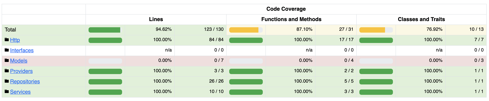

# Product Management assesment

## Entity-Relationship Model

Products `products`
`id`, `name`, `description`, `price`, `category_id`, `image`, `created_at`, `updated_at`

Orders `orders`
`id`, `product_id`, `user_id`, `quantity`, `order_date`, `created_at`

Users `users`
`id`, `name`, `created_at`, `updated_at`

Categories `categories`
`id`, `name`, `created_at`, `updated_at`


## API Definition

- This solution implements the JSON:API standard for responses,
ensuring consistency and eliminating the need for custom formatting.
- Endpoints [Documentation](readme/api.yaml) for products

## Install project

### Backend

- Create database, from your MySQL IDE or console execute this SQL

```sql

CREATE DATABASE `product_management`;
```
Create database for testing

```sql

CREATE DATABASE `test`;
```

- Create file `.env` from `.env.example`
- Open `.env` file and update database info using yours.
Don't forget to change `DB_CONNECTION` to `mysql`

```bash

DB_CONNECTION=mysql
DB_HOST=127.0.0.1
DB_PORT=3306
DB_DATABASE=product_management
DB_USERNAME=root
DB_PASSWORD=
```

- Add database for Testing

```bash

DB_DATABASE_TEST=test
```

- Save `.env` file
- From cli at project root execute composer

```bash

composer install
```

- Now create the `APP_KEY`

```bash

php artisan key:generate
```

- Execute migrations

```bash

php artisan migrate
```

for testing

```bash
php artisan migrate --database=test

```

- Execute seeder

```bash

php artisan db:seed
```

for testing

```bash

php artisan db:seed --database=test
```

- Create storage link to see uploaded images

```bash

php artisan storage:link
```

- Then, start the backend server with:

```bash

php artisan serve
```
By default, this will run on port `8000` if thar port is already in use, you can specify a differente one with:

```bash

php artisan serve --port=8080
```

### Frontend

Follow the instructions on the GitHub repository [product_management_frontend](https://github.com/ArielBlackymetal/product_management_frontend).

### SQL optimization

The following indexes have been created:

- **Table `products`**
  - Primary key on `id`
  - Index on `name` for search optimization
  - Index on `price` for price range queries
  - Index on `category_id` for category-based searches

- **Table `orders`**
  - Index on `product_id` to link orders to their respective products
  - Index on `order_date` for date-based searches
  - Index on `user_id` for user-specific searches

- **Table `categories`**
  - Primary key on `id`

- **Additional Index to Consider:**
  - A compound index on `orders.product_id` and `orders.order_date` to optimize queries that retrieve a product and group results by date.

- Additionally, for complex queries, the results can be stored in a separate table and updated periodically.

- Based on the assessment, the query constructed using the `orders` and `products` tables is:

```SQL
SELECT
    `products`.`id`,
    `products`.`name`,
    COUNT(orders.id) AS total_orders,
    ROUND(AVG(products.price), 2) AS average_price,
    SUM(products.price * orders.quantity) AS total_revenue
FROM `orders` INNER JOIN `products` ON `orders`.`product_id` = `products`.`id`
GROUP BY `products`.`id`, `products`.`name`
HAVING COUNT(orders.id) > 50
ORDER BY `total_revenue` DESC
```

- To optimize the query, instead of performing a join to retrieve the price and name from the `products` table, this values should be stored directly in the `orders` table.

```SQL
SELECT
    `orders`.`product_id`,
    `orders`.`product_name`,
    COUNT(orders.id) AS total_orders,
    ROUND(AVG(orders.price), 2) AS average_price,
    SUM(products.price * orders.quantity) AS total_revenue
FROM `orders`
GROUP BY `orders`.`product_id`
HAVING COUNT(orders.id) > 50
ORDER BY `total_revenue` DESC
```

- Finally, caching the queries can further improve performance.

### Best practices

- Followed the PSR-12 coding standard for clean and structured code.
- Created interfaces to implement repositories. While not strictly necessary for this project, this follows the Interface Segregation Principle.
- Implemented repositories to decouple the data access logic, making them easily interchangeable.
- Applied the Dependency Inversion Principle to improve code maintainability and flexibility.

### Test coverage



Running tests

```bash

php artisan test
```
or

```bash

php artisan test --coverage
```
or
```bash

./vendor/bin/phpunit --coverage-html coverage
```
Open `index.html` on coverage directory to see the coverage report.
